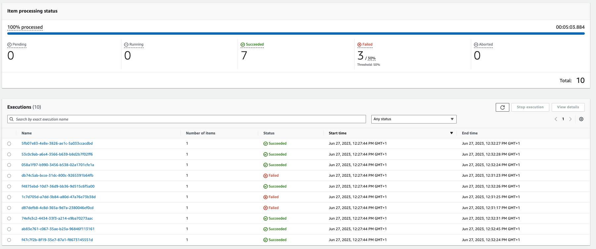

# DI Data Analytics Platform:  Athena Data Object Management

This README will define the process steps required to be completed to support the addition of new TxMA source data objects to be consumed as part of the reporting platform.  In addition it will cover scenarios whereby an existing source data object currently being consumed needs to be ammended.

The overall solution architecture covering the ingestion and raw -> stage data transforms is documented [here](https://govukverify.atlassian.net/wiki/spaces/DAP/pages/3578396963/DAP+-+TxMA+ELT+Data+Solution+Design).

<u>Source data objects can be considered at two levels</u>

- Product family
    * collection of related TxMA events.
- TxMA event
    * discrete TxMA event, consisting of a set of source data attributes requested via a TxMA configuration file.

## Developed Raw->Stage Solution Components

#### The following table details the core solution components developed to support the delivery of this functional capability.  Thereby enabling any project team member to onboard new TxMA data-sets as and when required.

| Component      | Description | Change Required | Repo Folder |
| ----------- | ----------- | --------------- | ----------- |
| Master Product Family configuration file  | One file exists for each data-source (e.g. TxMA).  This file outlines the Product Families that exists for this datasource.       | To add a new product family, add a new json object to this file e.g. `{"product_family": "dcmaw_cri","enabled": true}`.   The `enabled` attribute turns product families on/off for processing. | /athena-scripts/process_scripts/product_family_config.json  |
| Event to Product Family configuration file   | ***One*** mapping file per Product Family, capturing which events are associated with this Product Family, and need to be processed together. | To add a new event association to a product family, add a new json object to this file e.g. `{"event_name": "ipv_kbv_cri_start", "product_family": "ipv_cri_kbv", "enabled": true}`.   The `enabled` attribute turns events on/off for processing. | /athena-scripts/process_scripts/ name of each file is the product family name concatenated with ***_confg.json***. Example: ***ipv_cri_kbv_config.json*** |
| Product Family Table Schema defintions | The schema defintion for each product family table (Stage layer) is controlled and documented within a master spreadsheet.  The creation of these tables are managed using IAC. | Any changes to existing product family tables need to be communicated to the project team so that they can ammend the Glue Catalog table defintion.    As does the requirement to create new product family tables.   `Type: AWS::Glue::Table` | /iac/main/resources/stage.yml |
| Raw layer Glue Crawler | The 'raw' glue crawler discovers the metadata associated with the TxMA datasets landing in S3.  Metadata comprises of the tables and columns (+ datatypes) | To enable new events to be crawled via the 'raw' Glue crawler the S3 Target Path for the associated product family crawler needs to be updated with the new event path details.   `Targets:S3Targets:` | /iac/main/resources/raw.yml |
| Stage layer Glue Crawler | The 'stage' glue crawler discovers the metadata associated with the transformed product family datasets generated after processing the 'raw' TxMA events associated with the product family.  Metadata comprises of the tables and columns (+ datatypes) | To enable new product families to be crawled via the 'stage' Glue crawler the Catalog Table for the associated product family needs to be added to the crawler configuration.   `Targets:CatalogTargets:` | /iac/main/resources/stage.yml |
| Raw to Stage Insert DML | `SQL INSERT INTO` statements are run against each event to load transformed event datasets into the associated product family table.  | Create a new `INSERT INTO` statement for any new events or update existing statements if an change is required. | /athena-scripts/dml/insert_into     The file is named as per the event it is processing e.g. `dcmaw_app_end.sql` |

## Developed Redshift Solution Components

#### The following table details the core solution components developed to support the delivery of this functional capability.  Thereby enabling any project team member to onboard new TxMA data-sets as and when required.

| Component      | Description | Change Required | Repo Folder |
| ----------- | ----------- | --------------- | ----------- |
| Master Product Family configuration file  | One file exists for each data-source (e.g. TxMA).  This file outlines the Product Families that exists for this datasource.       | To add a new product family, add a new json object to this file e.g. `{"product_family": "dcmaw_cri","enabled": true}`.   The `enabled` attribute turns product families on/off for processing. | /athena-scripts/redshift_scripts/reporting_model_product_family_config.json  |
| Product Family reporting model population scripts   | ***One*** Stored Procedure file per Product Family, detailing the process logic to be run for this Product Family. | To add a new Stored Procedure for a product family, add a new .sql file e.g. `sp_<product_family_name>`.   For example `sp_auth_account_creation.sql`. | /athena-scripts/redshift_scripts/ name of each file is the product family name prefixed with ***sp_***. Example: ***sp_auth_account_creation.sql*** |

## Orchestration

The State machine initially reads the `product_family_config.json` configuration file to determine the scope of product families to process, for each 'enabled' product family a child process is spawned which processes all events mapped to that product family.
  

Any failures processing a product family are isolated and do not impact the other running processes.  All logging from the State machine is delivered to the following S3 bucket `${Environment}-dap-step-function-process-results` for further analysis.

# Local Setup for ETL job development
To create virtual env - 
`python3 -m venv venvlocal
source venvlocal/bin/activate
`
Install dev dependencies including the pre commit hook -
`cd src && pip install -r requirements.txt`

To run formatters and checks, use -
`isort .
black .
flake8 
`
